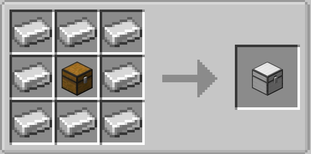

# Chest Shield

Chests only their owner can open, with permissions, an optional guest password
and configurable hopper access. Explosion-proof and no protection plugin needed.

A Fabric mod for Minecraft that adds a chest you configure from inside the chest
itself. Designed for survival servers where you want private storage without
installing a protection plugin.

## Features

- **Automatic ownership.** Whoever places the chest owns it. No commands, no setup.
- **Configured from inside the chest.** A lock button next to the chest screen
  opens everything: protection, password, hoppers and permissions.
- **Permissions.** Give a player access and they open the chest like you do. You
  can add someone who is offline; they get access the first time they join.
- **Protection switch.** Turn it off and the chest behaves like a vanilla one.
  Even then, only the owner can break it or change its settings.
- **Optional guest password.** For people who are not on your list. Passwords are
  hashed with PBKDF2 and never leave the server, so not even an administrator can
  read them from the world files.
- **Hoppers, but only if you say so.** Two independent switches for putting items
  in and taking them out, both off by default. When on, any mod that uses the
  Fabric Transfer API works with it, including Create, AE2 and Refined Storage.
- **Explosion proof.** TNT, creepers, beds and pistons do nothing to it, whether
  it is protected or not.
- **Double chests.** Two chests join into a 54 slot chest only when they belong to
  the same owner, so nobody can extend yours to reach your items.
- **Plays well with other mods.** It uses the vanilla chest screen, so inventory
  sorting mods keep working. Carry On cannot pick it up.
- **Master Key.** An admin item, obtainable only through commands, that opens any
  chest. Requires operator level 2 *and* the key held in hand.

## Usage

| Action | How |
|---|---|
| Craft | A vanilla chest surrounded by 8 iron ingots |
| Open | Right click, as the owner |
| Configure | Open the chest and click the lock button on the left |
| Enter a password | Right click, as anyone else |
| Inspect a chest | `/chestshield`, looking at it, as the owner or an admin |
| Get the Master Key | `/give @s chest_shield:master_key` |

Access granted by password lasts for that one opening. It has to be typed again
next time. Access granted by permission is permanent until you remove it.

## Requirements

- Minecraft 26.2
- Fabric Loader 0.19.3 or newer
- [Fabric API](https://modrinth.com/mod/fabric-api)

Required on both the client and the server. No other dependencies.

## Branches

One branch per Minecraft version. `26.1.2` and `26.2` are both maintained.

## License

MIT. See [LICENSE](LICENSE).
